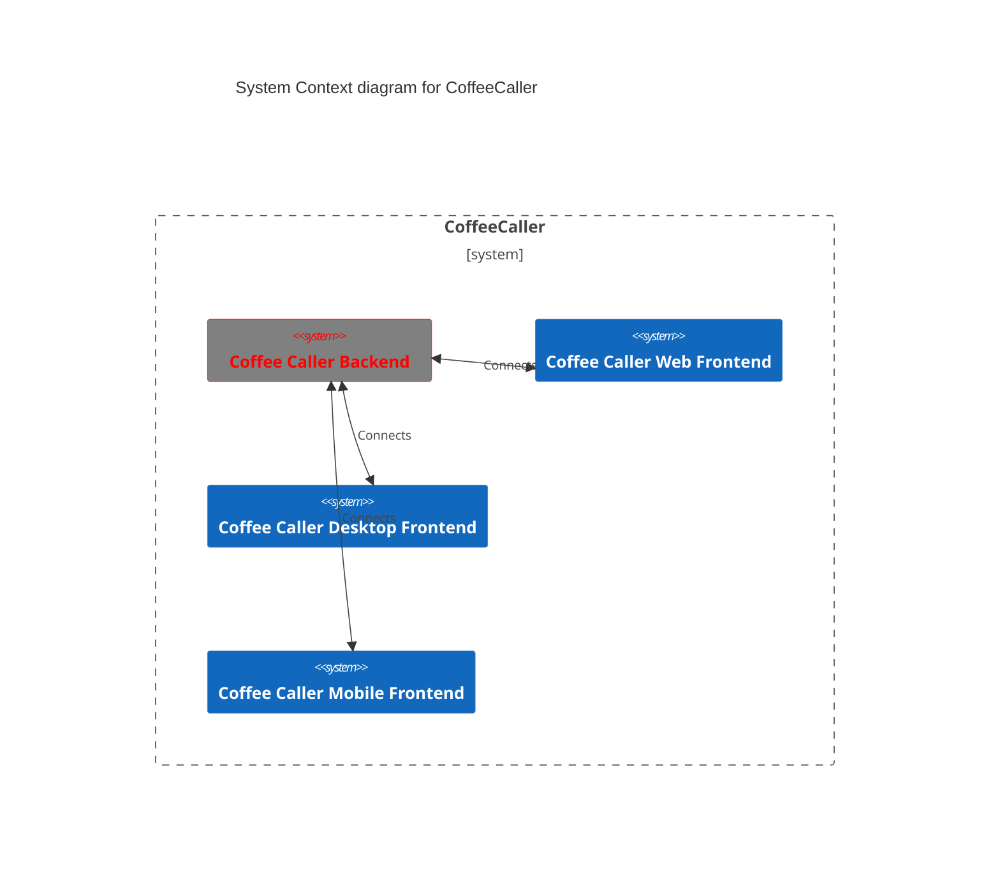
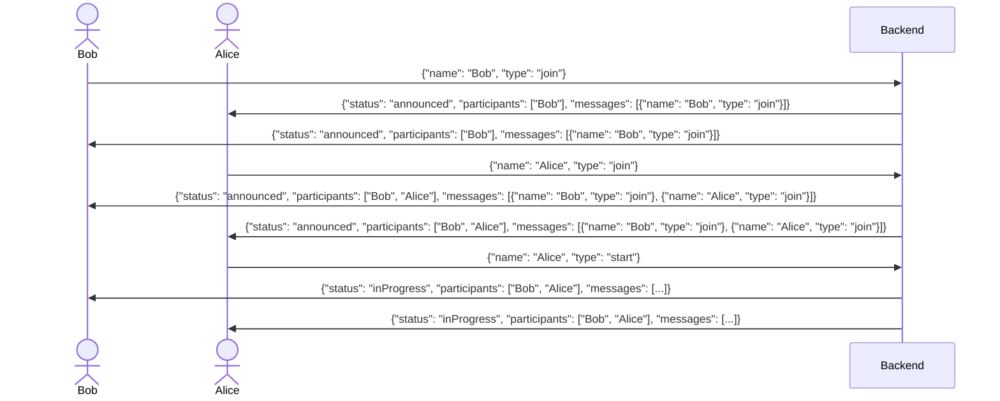

# coffee-caller

## Architecture

Communication works as follows:

## Backend setup

### With node

- Install [node](https://nodejs.org/en/)
- Run `npm install --global yarn` to install yarn
- Run `yarn` to install all dependencies
- Run `yarn serve` to start backend in watch mode
- Run `yarn start` to start backend

### With docker

- Install [docker](https://www.docker.com/) and [docker-compose](https://docs.docker.com/compose/) if not automatically installed
- Run `docker-compose up`

## Frontend setup

- Install [fvm](https://fvm.app)
- Run `fvm flutter run` to start the app
- ???
- Profit!

Happy coding :)
